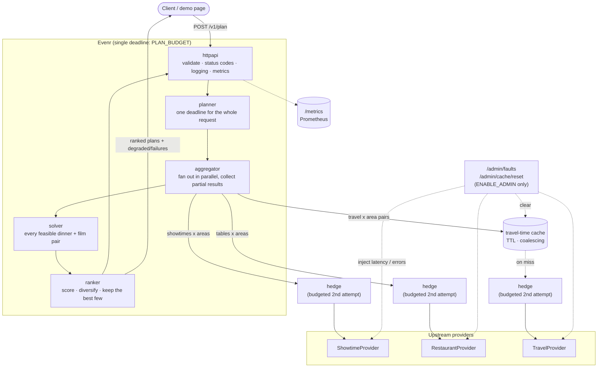

# Evenr

A backend that turns *"Saturday, 4 friends, near Indiranagar, ₹1500 each, want a movie and dinner"* into ranked, **feasible** itineraries, for example dinner at 6:30, then the 9:15 show, with travel time accounted for.

Built in Go. The interesting part is not the CRUD, it is two problems:

1. **Constraint solving.** Showtimes, table availability, travel time and budget all interact. A plan is only valid if every leg fits.
2. **A hard latency budget.** The answer needs several upstream sources (showtimes, restaurants, travel-time estimates). The service has to return a good answer within a fixed time even when one of them is slow or down.

## Data

Showtimes, tables and travel times are **deterministically generated mocks**
(`internal/providers/mock.go`, `catalog.go`), not live data. The same request always
returns the same catalogue; nothing is fetched from the internet. This was deliberate:
the project is about the resilience machinery around fetching data under a latency
budget (fan-out, partial results, caching, hedging), not about scraping or integrating
third-party listings. Each of the three sources sits behind a small interface
(`ShowtimeProvider`, `RestaurantProvider`, `TravelProvider` in `internal/providers/providers.go`),
so a real implementation can be substituted without touching the aggregator, solver,
ranker or HTTP layer. See [Future scope: real-time data](#future-scope-real-time-data).

## Results

Measured at 250 requests/s with the built-in mock upstreams (15 ms base latency each) and a 300 ms budget. Full method, all eight scenarios and caveats are in [docs/benchmarks.md](docs/benchmarks.md).

| Situation | Result |
|-----------|--------|
| Healthy | p99 28 ms |
| Travel upstream 2 s slow | Answers at the 300 ms budget with estimated travel times, flagged in the response |
| Same, with a warm cache | p99 28 ms, no effect |
| 2% of upstream calls take 1 s | Without hedging: p99 302 ms, 11.7% of responses degraded. With budgeted hedging: **p99 77 ms, 0.14% degraded**, for about 2% extra upstream calls |
| 5% of upstream calls take 1 s | Hedging cuts degraded responses from 25.8% to 1.3%, but **p99 stays at ~300 ms**, because 1.3% is still above the 1% that p99 measures. The write-up explains why |

These are mocks on one machine, single runs, and the load generator shares the CPU. They show how the budget, cache and hedging behave, not real-world capacity.

## Design

Each request has one deadline. Upstream calls run in parallel and whatever has arrived by the deadline is used; the response says what was missing. Details and trade-offs are in [docs/design.md](docs/design.md).



In short:

- **Partial results over errors.** A slow or failed dependency degrades the answer instead of failing it. Unknown travel time falls back to a pessimistic estimate that is flagged and ranked lower.
- **Travel-time cache** with TTL, symmetric keys and request coalescing. The fetch outlives the request that started it, so a request that times out still warms the cache for the next.
- **Hedged requests with a budget**, so hedging cannot double the load on an upstream that is already struggling. The cache sits outside the hedge, otherwise the hedge would just join the first attempt's fetch.
- **Deterministic solver and ranking.** Same inputs give the same output, so tests are exact. A property test checks every plan the solver returns against the constraints across many party sizes and budgets.
- **Open-loop load generator** that measures from each request's scheduled time, so it cannot hide slow requests.

## Layout

```
cmd/server/          entrypoint
cmd/loadgen/         open-loop load generator
internal/itinerary/  domain model, constraint solver, ranking
internal/providers/  upstream interfaces, mocks with fault injection, cache, hedging
internal/aggregator/ parallel fan-out to providers under one deadline
internal/planner/    runs fetch, solve and rank for one request
internal/httpapi/    HTTP handlers, demo page (web/), request logging, fault-injection admin endpoints
internal/metrics/    Prometheus metrics
internal/app/        assembles the service from config
scripts/bench.sh     runs the benchmark scenarios
docs/                design notes, benchmark results
```

## Run

```bash
go run ./cmd/server
go test ./...
```

Then open <http://localhost:8080>. The page plans an evening and shows each plan, how long the
service took, and whether any upstream failed or timed out.

To watch it cope with a failing dependency, start it with the admin controls on:

```bash
ENABLE_ADMIN=true go run ./cmd/server        # PowerShell: $env:ENABLE_ADMIN='true'; go run ./cmd/server
```

A "Break a dependency" panel appears. Set the travel service to **Slow (2 s)**, click
**Clear the cache**, and plan again: the answer still arrives in about 300 ms, marked
*Degraded*, with the affected travel times labelled as estimates.

### Configuration

| Variable | Default | Meaning |
|----------|---------|---------|
| `ADDR` | `:8080` | Listen address |
| `PLAN_BUDGET` | `300ms` | Total time allowed for a request's upstream calls |
| `CACHE_TTL` | `10m` | Travel-time cache lifetime; `0` turns the cache off |
| `HEDGE_DELAY` | `0` (off) | Wait this long before sending a hedged second attempt to an upstream |
| `HEDGE_RATIO` | `0.1` | Hedge budget: hedges allowed per request |
| `ENABLE_ADMIN` | off | Exposes `/admin/faults` (inject latency/errors into the mock upstreams) and `/admin/cache/reset`; for demos and benchmarking only |

Metrics are served at `/metrics` in Prometheus format: request latency histograms by route and status, degraded plans, upstream failures by source and reason, and cache and hedge counters.

## API

`POST /v1/plan`

```bash
curl -X POST localhost:8080/v1/plan -d '{
  "date": "2026-09-26",
  "area": "indiranagar",
  "party_size": 4,
  "budget_per_person": 1500
}'
```

Returns the best few dinner-and-film plans, best first. Each leg says how long the
trip to it takes and whether that travel time was `travel_estimated`. If an upstream
timed out or failed, the response still succeeds with what was available and sets
`"degraded": true` with a `failures` list (`timeout`, `unavailable`, ...).

| Status | Meaning |
|--------|---------|
| 200 | Plans returned (possibly degraded, possibly empty) |
| 400 | Malformed body, bad date, or invalid party size / budget |
| 413 | Body over 64 KB |
| 422 | Area not recognised |
| 503 | Every upstream failed, nothing to plan from |

## Not done

- Real upstream clients and a real, continuously updated catalogue — see
  [Future scope: real-time data](#future-scope-real-time-data).
- Per-source deadlines, adaptive hedge delay and circuit breakers, described in [docs/design.md](docs/design.md).
- Distributed tracing.
- `go test -race`: it needs cgo, which was not available where this was built, so the
  concurrency-heavy tests have not been run under the race detector.

## Future scope: real-time data

Right now the three upstreams are mocks. Moving to real, continuously updated data would
not change the aggregator, solver, ranker or HTTP layer — they already depend only on the
`ShowtimeProvider` / `RestaurantProvider` / `TravelProvider` interfaces. What changes is
what sits behind those interfaces and how it stays fresh.

**1. Real upstream clients.** Implement the three interfaces against real sources instead
of the mocks:
- **Showtimes:** a cinema-chain API (e.g. BookMyShow/Paytm-style partner feeds) or a
  scraper, keyed by venue and date.
- **Tables:** a reservation platform's API (e.g. a Zomato/OpenTable-style partner feed) for
  live seat/table availability.
- **Travel:** a real routing API (Google Distance Matrix, Mapbox, OSRM) instead of the
  straight-line-distance estimate.

Each one is dropped in behind its interface; `internal/app/app.go` is the one place that
wires a provider into the service, so swapping mock for real is a one-line change per
source.

**2. Keeping it current — two complementary approaches:**

- **Pull, on a schedule, into a store the request path reads from.** A background job
  polls each upstream (showtimes a few times a day, tables and travel far more often) and
  writes into Postgres/Redis. `/v1/plan` never calls the third-party API directly — it
  reads the store, which keeps the latency budget intact even if the real upstream is slow
  or rate-limited. This is the natural evolution of the existing travel-time cache: the
  same TTL-and-refresh idea, just fed by a scheduler instead of by request-triggered
  fetches.
- **Push, via webhooks, for things that change unpredictably.** A cancelled screening or a
  table becoming free doesn't wait for the next poll. If the upstream offers webhooks, a
  small handler updates the store the moment the event arrives, and the next `/v1/plan`
  sees it immediately. Polling remains the fallback for sources without push support.

**3. Cache invalidation on the existing travel cache.** The current `CachedTravel` uses a
fixed TTL. With a real routing API, travel times still change slowly (mostly with traffic
conditions), so TTL-based expiry is fine, but the TTL should be shorter at peak traffic
hours and the cache should be sized per (area pair, time-of-day bucket) rather than just
per area pair.

**4. Staleness has to be visible, not just fast.** The response already reports
`degraded` and estimated travel times when an upstream fails; the same honesty should
extend to real data — e.g. a `data_as_of` timestamp per source in the response, so a
client can tell "these showtimes are from 2 minutes ago" from "these are from this
morning's sync."

**5. Rate limits become a real constraint.** Real upstream APIs are rate-limited and
sometimes paid per call. This is exactly what request coalescing (in the cache) and the
hedge budget already exist to control — they would need tuning against the specific
provider's limits, but the mechanism doesn't change.

## How AI was used

I built this with Claude Code (Claude Sonnet 5), working through the project in small steps: domain model, mock upstreams, fan-out, solver, ranking, HTTP layer, cache, hedging, metrics, load generator. The project choice, the Go stack, the name and the scope were mine; Claude wrote most of the code and tests from those instructions, and each step is its own commit (commits carry a `Co-Authored-By` trailer).

Some of what that looked like in practice:

- **Tests as the check on generated code.** Each piece has boundary tests (a film at 20:15 passes, 20:14 fails), and the solver has a property test that verifies every plan it returns independently. Timing-sensitive tests were run repeatedly to look for flakiness.
- **The benchmark result that did not flatter the design.** At a 5% tail, hedging did not improve p99. That was reported as measured, explained with the arithmetic (both attempts slow ≈ 0.25% per call across about six calls), and a 2% scenario was added rather than dropping the awkward one. Both are in the benchmarks.
- **A bug the tests did not catch.** Running the finished service by hand showed a request for Indiranagar returning four plans in MG Road: every unit test passed because nothing in the ranking rewarded staying near the requested area. It was fixed with a proximity score and a regression test.
- **Limits stated up front:** mocks not a network, single runs, no race detector.
